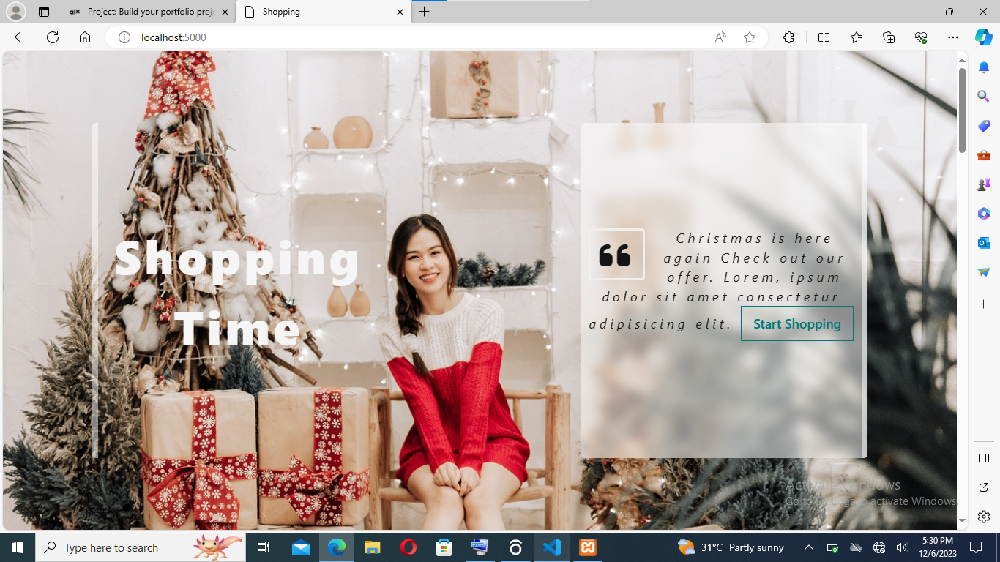
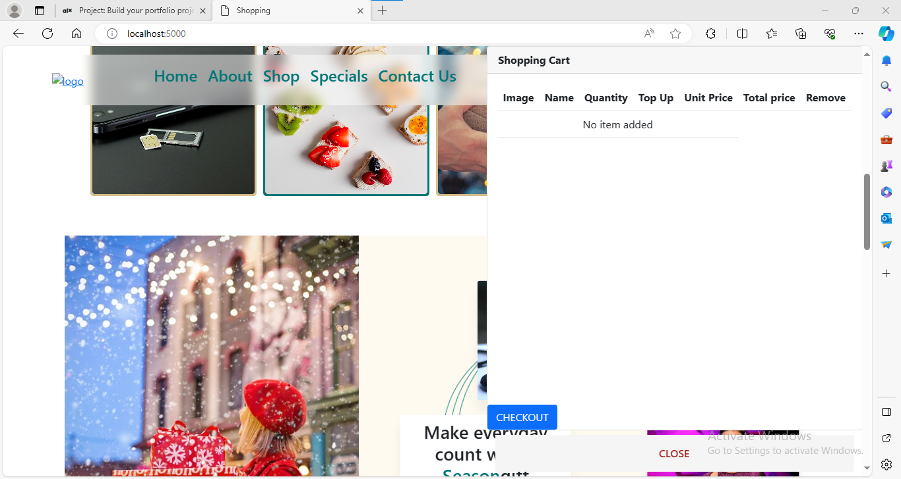
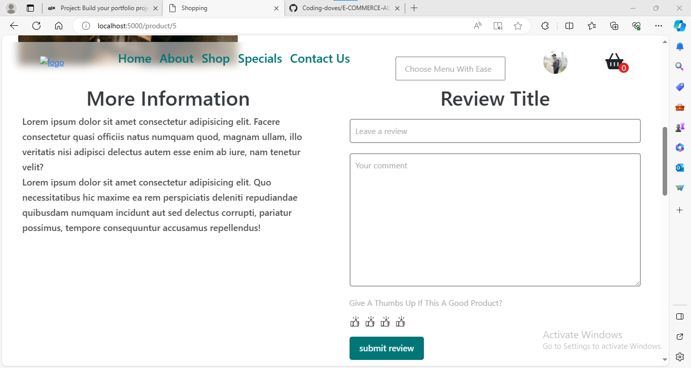

# Building an ecommerce site with blockchain payment system also with the traditional payment system
[![Visit My Site]](http://browndove.tech/E-COMMERCE-ALX)

# LOOK UP

- [Repo Link](#repo-link)
- [Inspiration](#story)
- [Some features](#features)

## Smart contract
To be built on Etherum
## Other payment intergration
stripe payment system

### Some Features
- Add to Basket

you can view whatever picked in the basket without leave the current market place you are on. increase and also decrease the quatity there in the basket 

- Review Product

user are able to leave their opion about any product go or bad. This aids in track poor customer experience.

- Blockchain payment and tradition payment
You also purchase either with stripe payment system or pay with your eth.

## Project Inspiration
The inspiration to build an ecommerce came from the desire of wanting to create an ecommerce store for my mum who is a mobile trade. I hope this will grow her business with less stress. Enabling her customer see her product for their comfort zone while placing order.
I also wanted to enable platform where crypto coins owners can purchase need items with their assets without having to worry about converting it or withdrawing it a their local banks before transacting.
And So i decided to built it as a Portfolio Project for Holberton School 
 [![Holberton School]](https://www.holbertonschool.com/).

### Repo (project) Link
- https://github.com/Coding-doves/E-COMMERCE-ALX

### Author's social links
- GitHub: https://github.com/Coding-doves
- LinkedIn: https://www.linkedin.com/in/ada-okonkwo-a1b597229/
- X: https://twitter.com/AdaOkonk1

### Installation

### Usage

### Contributing

### Related projects

### Licensing

### Tools used

- Nodejs with Express
- MySQL DB
- Solidity
- HTML5, CSS, and JS
- Bootstrap
- Openzepplin
- Splash(for free images)
- google font(for free font)

## Video Demo

[Back to Top](#up)
