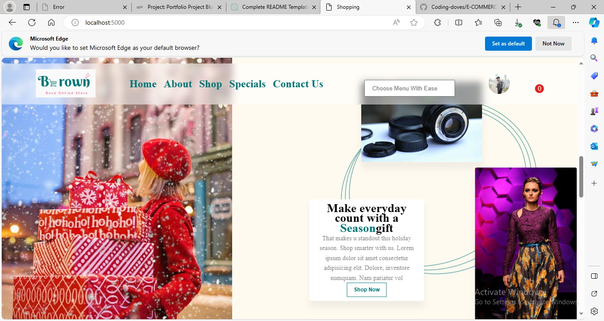

<a name="up"></a>


# Building an ecommerce site with blockchain payment system also with the traditional payment system
[![Visit My Site]](http://browndove.tech/E-COMMERCE-ALX)

# LOOK UP

- [Repo Link](#repo-link)
- [Inspiration](#story)
- [Some features](#features)

## Smart contract
To be built on Etherum
## Other payment intergration
stripe payment system

<a name="features"></a>

### Some Features
- Add to Basket


you can view whatever picked in the basket without leave the current market place you are on. increase and also decrease the quatity there in the basket 

- Review Product

user are able to leave their opion about any product go or bad. This aids in track poor customer experience.

- Blockchain payment and tradition payment
You also purchase either with stripe payment system or pay with your eth.

<a name="story"></a>

## Project Inspiration

The inspiration to build an ecommerce came from the desire of wanting to create an online store for my mum who is a mobile trade. I hope this will grow her business with less stress. Enabling her customer see her product for their comfort zone while placing order.
I also wanted to enable platform where crypto coins owners can purchase need items with their assets without having to worry about converting it or withdrawing it a their local banks before transacting.
And So i decided to built it as a Portfolio Project for Holberton School 
 [![Holberton School]](https://www.holbertonschool.com/).

## My Portfolio Project: A Human Journey in Code
- Introduction
Welcome to my portfolio project, a digital representation of my journey through the world of coding. This project is not just about showcasing technical skills but about sharing the human experience behind the keyboard. As you explore this portfolio, you'll find not just lines of code but a story of inspiration, challenges, and the relentless pursuit of improvement.

[Visit My Portfolio](http://browndove.tech/E-COMMERCE-ALX)


- Author:

    Ada Okonkwo - https://www.linkedin.com/in/ada-okonkwo-a1b597229/

- Inspiration and Purpose

    In the vast sea of impressive technical projects, my portfolio may not be the most groundbreaking, but it is a reflection of my unique journey. The inspiration for this project stems from the realization that every line of code represents a learning moment, a challenge faced, and a problem solved. I wanted to create a space that not only highlights technical achievements but also serves as a testament to the dedication, passion, and continuous growth that define a coder's journey.This project wasn't an easy pick, it was to be a test of brave. Watching my mum go out daily to make sales under the heat carrying large leather of cloth material moving  from one office to  another,with little hope of reducing the goods through sales before the end of day made me decide to try out an online store to see how close i can get to making sales  a fun one for her. Since  most her customers can surf the internet  with easy, i hope  with the successful  completion of this project they  will be able to pick  of any  item  that instrest them make payment and then she can delivery their item in person or through a logistic firm.

    Having to implement eth paymment system  comes the desire of wanting to buy items from online store without having to withdraw it into my local bank. I also believe their many like me who  desire such.

- Technical Challenges

    As I embarked on this project, I faced challenges that every coder can relate to - the struggle to translate ideas into code, the endless debugging sessions, and the pursuit of simplicity in design. I chose to share not only the polished end result but also the messy, intricate process that led to it. This is not just a showcase; it's an honest narrative of where I stumbled and how I rose above the challenges.

    As a trainee, it really confusing trying to put together the tools one has been given to acheive this project. This is where google and youtube came to the recuse, they were of great help to me. implemeting the logic to build this project wasn't any easy one for me. Being aware during the cause of my training in Alx, that the logic needed implement this task can be used across programming language I decided to work with nodejs and express. At first, it was easy and simple; setting up the needed folders and files, installing, importing and connecting express, nodejs, multer, ejs
    , body-paser, mysql ..., was all fun at first. I created the database and tables I would likely need for starting. Then, CRUD (Create Read Update Delete) stepped forward; I began working and learning how get desired pages and post desired forms. And so, the page grew bigger, messy and confusing. At this point, Router showed up; it was called and put to use, this handled the mess but not the confusion. Burnout was my companion a lot of times it can be frustrating not knowing how to implement a feature or seeing ones program crash and bug filled. Presently, the project is in progress...

    - The Human Touch

    Behind every commit, every algorithm, and every design choice, there's a human being with a story. This portfolio is a reminder that the coder is not just a machine producing code but a person with passion, creativity, and a unique approach to problem-solving. I hope you see beyond the code and connect with the person behind the keyboard - someone you'd want to work with, collaborate with, and learn from.

- Next Iteration

    This portfolio is a living document of my coding journey, and just like any good code, it's open to continuous improvement. In the next iteration, I envision expanding the project with more interactive elements, incorporating feedback from the community, and diving into new technologies. The journey doesn't end here; it evolves, and so does this portfolio.

- Visual Highlight



- Conclusion

    Thank you for taking the time to explore my portfolio. I hope this README gives you a glimpse into the human side of coding and sparks curiosity about the stories behind the projects we create. Feel free to reach out; I'm not just a coder, I'm a person excited to connect, share experiences, and collaborate on future endeavors.


<a name="repo-link"></a>

### Repo (project) Link
- https://github.com/Coding-doves/E-COMMERCE-ALX

### Author
- Ada Benedicta Okonkwo:
    - GitHub: https://github.com/Coding-doves
    - LinkedIn: https://www.linkedin.com/in/ada-okonkwo-a1b597229/
    - X: https://twitter.com/AdaOkonk1

### Installation
```
# Clone the repository
git clone https://github.com/Coding-doves/E-COMMERCE-ALX.git

# Navigate to the project directory
cd your-project

# Install dependencies
npm install

```

### Usage
```
# Run the application locally
node index.js

```
### Contributing
Contribution is need with intergrating various other payment system
clone the repo in intergrated payment system that has not been intergrated and send pull request with descriptive text of what was intergrated

### Related projects
- [Some list of Java](https://github.com/Coding-doves/UoPeople_Code.git)
- [School site UI](https://github.com/Coding-doves/schoolsite)

### Tools used

- Nodejs with Express
- MySQL DB
- Solidity
- HTML5, CSS, and JS
- Bootstrap
- Openzepplin
- Splash(for free images)
- google font(for free font)
- Canvas (logo maker)


### Licensing

MIT License

Copyright (c) [2023] [Ada B. Okonkwo]

Permission is hereby granted, free of charge, to any person obtaining a copy
of this software and associated documentation files (the "Software"), to deal
in the Software without restriction, including without limitation the rights
to use, copy, modify, merge, publish, distribute, sublicense, and/or sell
copies of the Software, and to permit persons to whom the Software is
furnished to do so, subject to the following conditions:

The above copyright notice and this permission notice shall be included in all
copies or substantial portions of the Software.

THE SOFTWARE IS PROVIDED "AS IS", WITHOUT WARRANTY OF ANY KIND, EXPRESS OR
IMPLIED, INCLUDING BUT NOT LIMITED TO THE WARRANTIES OF MERCHANTABILITY,
FITNESS FOR A PARTICULAR PURPOSE AND NONINFRINGEMENT. IN NO EVENT SHALL THE
AUTHORS OR COPYRIGHT HOLDERS BE LIABLE FOR ANY CLAIM, DAMAGES OR OTHER
LIABILITY, WHETHER IN AN ACTION OF CONTRACT, TORT OR OTHERWISE, ARISING FROM,
OUT OF OR IN CONNECTION WITH THE SOFTWARE OR THE USE OR OTHER DEALINGS IN THE
SOFTWARE.

[Back to Top](#up)
